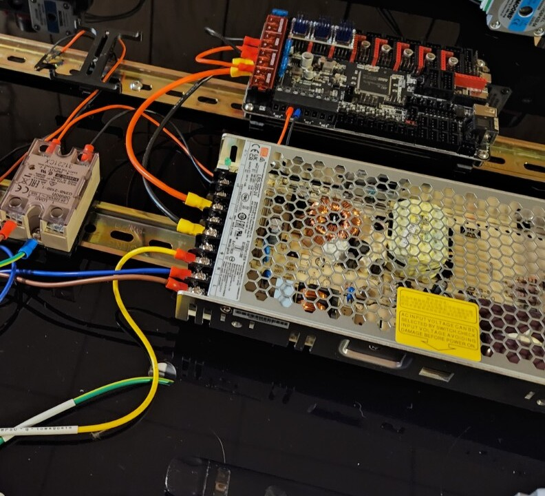
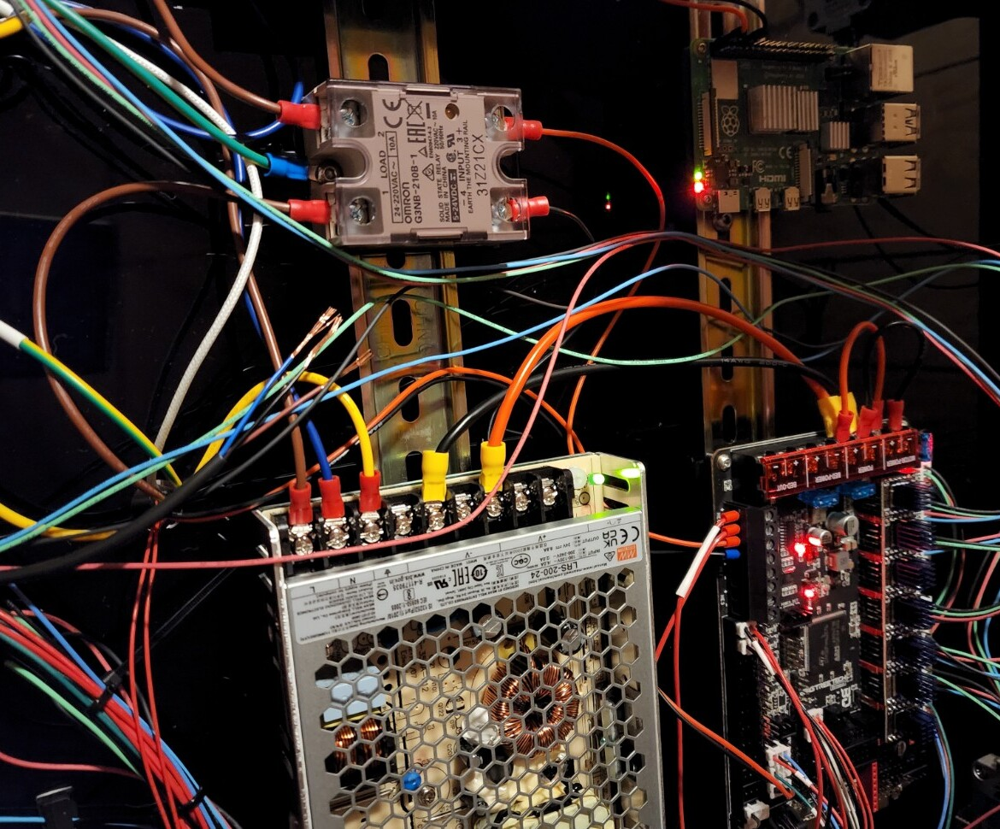
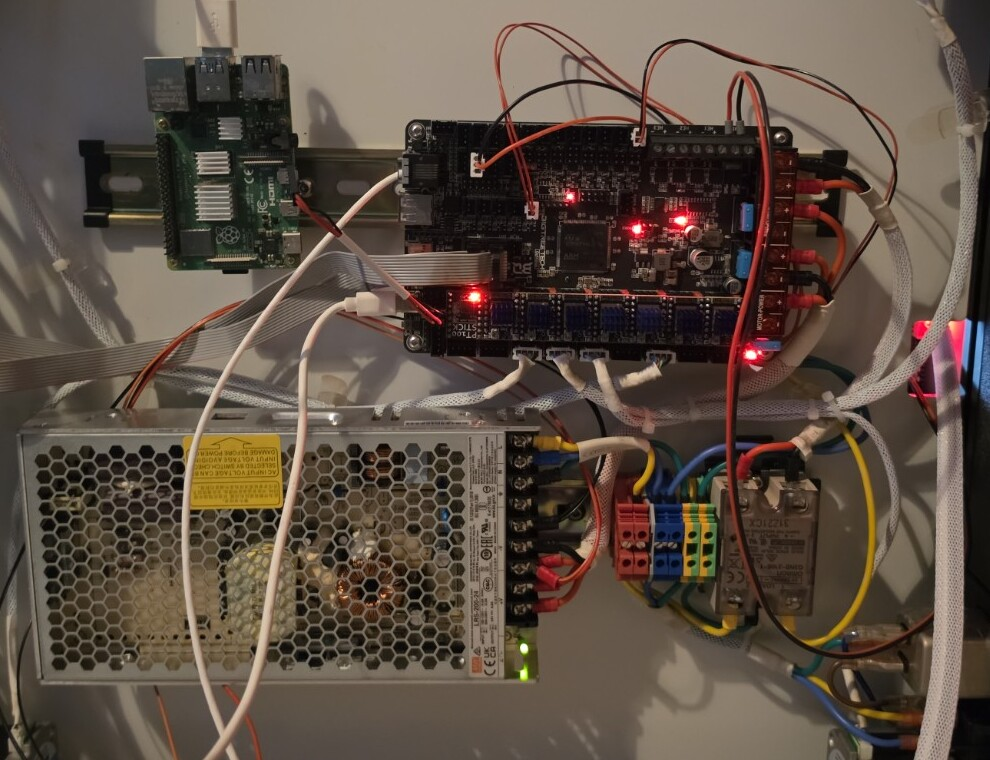
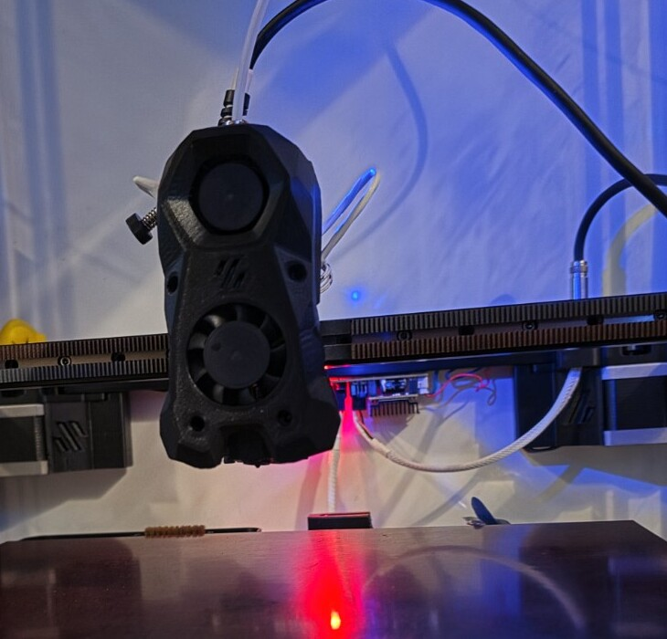
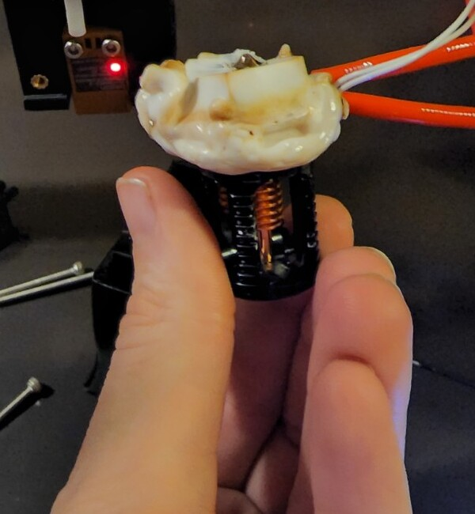
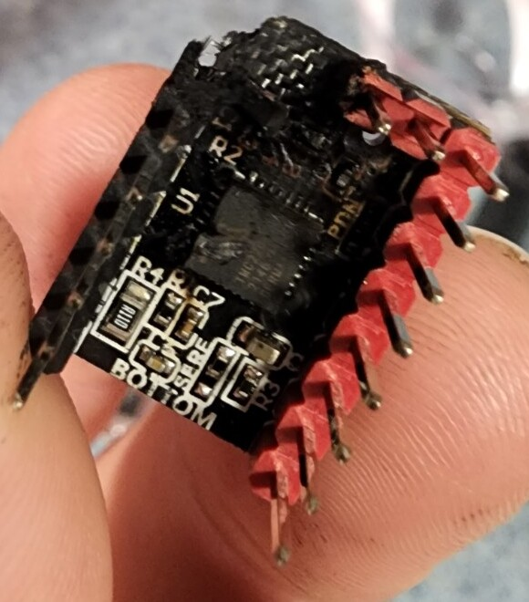
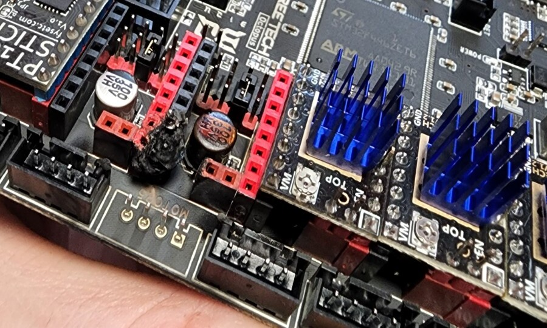
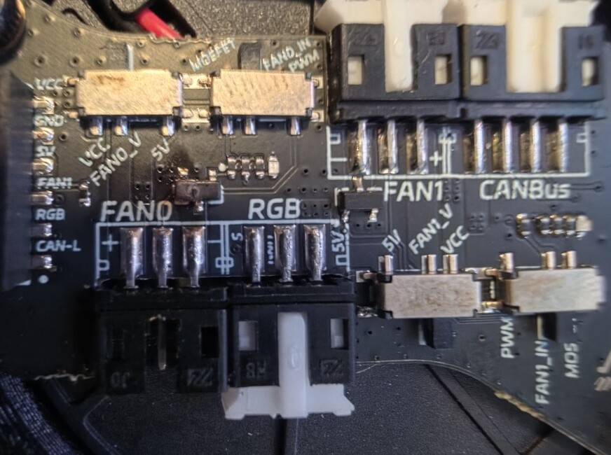

# Build photos and repair history

This printer has been through several wiring layouts, a failed print that buried the hotend in filament, and a couple of electrical failures. These photos document the work along the way. The earlier photos show historical states; the current toolhead and electronics bay are shown separately below.

[Back to the README](../README.md) · [Hardware notes](../HARDWARE-NOTES.md) · [Upgrade plans](upgrades.md)

## Electronics-bay progression

These three photos are in build order. Exact dates for the early photos aren't recorded here.

### Early layout

An early stage of the electronics layout, with the controller, power supply, and SSR mounted on DIN rails.

### Wiring in progress

More of the wiring connected, with the Raspberry Pi installed. This is an earlier build state, before the subsequent wiring cleanup.

### Current electronics bay — September 2026

Current electronics bay ahead of the rebuild, showing revised cable routing, sleeved harnesses, and DIN-rail terminal blocks.

## Current toolhead

Stealthburner with Galileo2 and CAN-connected toolhead electronics, ahead of the rebuild. The FAN0 repair described below is still pending.

## Failures and repairs

### Dragon hotend: failed-print filament buildup

A failed print kept extruding for an unknown amount of time and left a large buildup of filament around the hotend. I managed to recover and reuse the entire Dragon hotend.

**Outcome:** hotend recovered and reused.

### Stepper driver and mainboard arc damage

An electrical arc damaged the stepper driver and surrounding mainboard area, leaving the printer inoperative. Poor wiring in the electronics compartment was the suspected cause, though the exact fault wasn't confirmed.

**Outcome:** I replaced the damaged mainboard.

### Toolhead FAN0 MOSFET

I damaged the FAN0 MOSFET during an attempted board swap with power still connected. This photo shows the failed component before removal.

**Status, September 2026:** replacement components ordered; repair pending.

**Lesson learned:** fully disconnect power before swapping boards.
